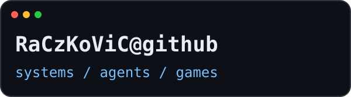
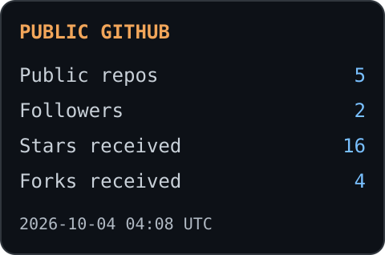

# RaCzKoViC

**Systems · AI Agents · Games · Developer Tools**

[Projects](#projects) · [Stack](#stack) · [Activity](#activity)

## About me

I build and explore operating systems, AI-agent infrastructure, developer tools and games. I work with AI coding assistants and investigate how software works under the hood.

- **Systems:** Rust, operating-system development and Linux.
- **AI:** agent orchestration, local models and tool integration.
- **Games:** mining, exploration, crafting and progression.
- **Workflow:** VS Code, terminal, Git and AI-assisted development.

## 🧭 Projects

### [RacOS](https://github.com/RaCzKoViC/RacOS)
A Rust operating-system project: kernel, bootloader and userspace.

### [Odysseus-Lab](https://github.com/RaCzKoViC/Odysseus-Lab)
An experimental laboratory for development and AI workflows.

### [AgentBox](https://github.com/RaCzKoViC/AgentBox)
Agent-oriented tools and execution environments.

### [CodeMap](https://github.com/RaCzKoViC/CodeMap)
Tools for exploring and understanding code.

### [The MinerGuy](https://github.com/RaCzKoViC/The-MinerGuy)
A mining, exploration and crafting game built with C# and MonoGame.

## 🛠 Stack

**Languages**  
Rust · Python · TypeScript · JavaScript · C#

**Environment**  
Windows · Ubuntu / Linux · iOS

**Tools & infrastructure**  
Git · VS Code · Docker · PostgreSQL · Qdrant · Redis · NATS · MCP

**AI development**  
Claude Code · Codex · Kimi · Local LLMs · vLLM

## 📊 Activity

Statistics cover public repositories. Stars and forks exclude forked repositories. Refreshed every six hours by GitHub Actions.

---

<a href="https://github.com/RaCzKoViC?tab=repositories">Browse all repositories</a>

